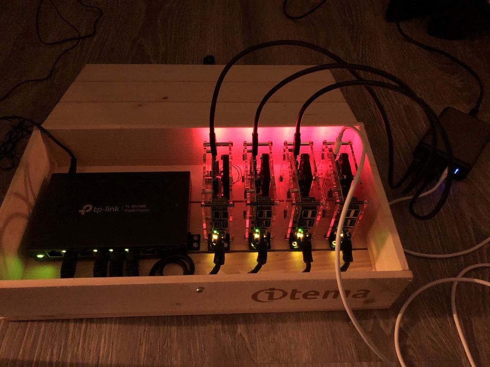

# RaspberryPi Cluster

Setting up a cluster of RaspberryPis with [Ranchers k3s kubernetes engine](https://k3s.io) just for fun :)

Inpired by this blog post by Allex Ellis: [Will it cluster? k3s on your Raspberry Pi](https://blog.alexellis.io/test-drive-k3s-on-raspberry-pi/), and this k3s cluster demo by Sheldon Lo-A-Njoe from Rancher Labs: [K3s and RaspberryPi to Go](https://www.youtube.com/watch?v=fkMB8DnGiaA)

