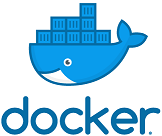
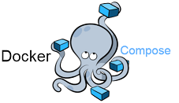

# Simple FaaS with Python on Kubernetes

Training with Kubernetes and Python using a local [Minikube](https://minikube.sigs.k8s.io/docs/).

## Function as a Service (FaaS)

FaaS is a technique for wrappingnyour code and functions in a small webserver, and then host this at
a cloud, or your local machine.

In this example a simople Pythion function will be created, and hosted with Falsk inside a Docker container.
After this the container will be deployed to a local minikube, and invoked using HTTP.

Example based on [Getting Started With Kubernetes for Python](https://medium.com/better-programming/getting-started-with-kubernetes-for-python-254d4c1d2041)
on Meduim.

## Install and Start Minikube (Mac OS)

    $ brew update
    $ brew install minikube

Start minikube

    $ minikube start
    $ minikube status

This will set up a local kubernetes cluster running on you local machine.
Minikube will also install `kubernetes-cli (kubectl)`.

Test that the installation is working with the following command:

    $ kubectl get nodes

## Build and Test Container

### Build

Build the docker container and push it to docker hub with the `build.sh`script (`build_arm.sh` for RaspberryPi)
Remember to change your docker hub username :)

    $ ./build.sh

### Run Docker Image



*Docker Logo*

Rune the Docker image with the following command

    $ docker run --rm -p 8080:8080 <YOUR-USER>/faas-simple-flask:latest

Test the container by going to `localhost:8080` in your web-browser

## Run With Docker Compose x 4



*Docker Compose Logo*

After the test function has been built, it can be run by docker-compose in a 4x setup

    $ docker-compose up -d

Verify the containers are running

    $ docker-compose ps

Test the different endpoints by running the following

    $ curl localhost:10001
    $ curl localhost:10002
    $ curl localhost:10003
    $ curl localhost:10004

Now you have 4 replicas of this function running as separate containers, 
and docker-compose is responsible for keeping them running (just like a service contract)  

Stop the containers with the following command

    $ docker-compose down

## Run it on Kubernetes


*Kubernetes logo*

Deploy the container and service to kubernetes

    $ kubectl apply -f faas-simple-flask.yaml

Verify status

    $ kubectl get pods

## Access WebServer in minikube

Minikube needs to export the LoadBalancer service, so that it can be accessed from the outside.

### Using Minikube tunnel (easiest)

    $ minikube tunnel
    
### Using minikube service

    $ minikube service faas-simple-flask-service

**Output from minikube service**

```
🏃  Starting tunnel for service faas-simple-flask-service.
|-----------|---------------------------|-------------|------------------------|
| NAMESPACE |           NAME            | TARGET PORT |          URL           |
|-----------|---------------------------|-------------|------------------------|
| default   | faas-simple-flask-service |             | http://127.0.0.1:51122 |
|-----------|---------------------------|-------------|------------------------|
```

### Test WebServer with Curl

Run the following command, replacing the adress with the output from the minikube service

    $ while true; do curl http://127.0.0.1:8081 ; sleep 0.2; done

Now you should see an output like this

```
"Hello from faas-simple-flask-64679c8d59-49hcz"
"Hello from faas-simple-flask-64679c8d59-jnmkv"
"Hello from faas-simple-flask-64679c8d59-jnmkv"
"Hello from faas-simple-flask-64679c8d59-xlcff"
"Hello from faas-simple-flask-64679c8d59-xlcff"
"Hello from faas-simple-flask-64679c8d59-9qpv9"
```

Now we see that the network traffic is LoadBalanced to the different pods running on the Kubernetes system

**Run with Query Parameters**

Test with Query Paramaters

    $ while true; do curl http://127.0.0.1:8081/?user=john&time=234 ; sleep 0.2; done

### Delete deployment

Clean up the resources created

    $ kubectl delete -f faas-simple-flask.yaml

**Stop minikube Cluster**

Stop the minikube cluster with the following command

    $ minikube stop

**Delete minikube Cluster**

Stop the entire minikube cluster with the following command

    $ minikube delete
