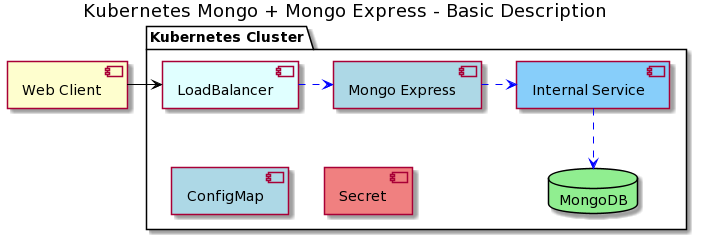
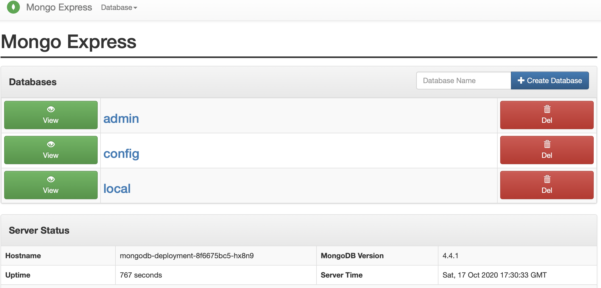

# Mongo and MongoExpress Demo

To get to know all the different components in a basic kubernetes setup, this demo can be used.

Demo inspired by [Docker and Kubernetes Tutorial | Full Course [2020]](https://www.youtube.com/watch?v=bhBSlnQcq2k),
and [TechWorld with Nana](https://www.youtube.com/channel/UCdngmbVKX1Tgre699-XLlUA)

## Kubernetes Demo

*Basic kubernetes pieces*

The following commands will work on any kubernetes cluster, but this demo uses `minikube`.

A MongoDB deployment will be created containing the MongoDB Docker container. This uses secrest defined in the secret store when setting up. Also an Internal service will be created to expose the MongoDB pod to the cluster internally.

Then the MongoExpress pod will be created referencing the MongoDB service URL by the provided configMap, and the credentials using the secrets.

Finally a LoadBalancing service will be created to expose the MongoExpress pod outside the cluster.

### Install and Start Minikube (Mac OS)

    $ brew update
    $ brew install minikube

Start minikube

    $ minikube start
    $ minikube status

This will set up a local kubernetes cluster running on you local machine.
Minikube will also install `kubernetes-cli (kubectl)`.

Test that the installation is working with the following command:

    $ kubectl get nodes

### Deploy MongoDB Demo Kluster

Now we are ready to deploy the differnet modukles on to our kubernetes cluster.

**Deploy Secrets**

First we need to deploy the `mongo-secret.yaml`file. This file contains the admin username and password used when deploying the MongoDB Pod

    $ kubectl apply -f mongo-secret.yaml

Verify that the secret was created

    $ kubectl get secrets
    $ kubectl describe secrets mongodb-secret

**Deploy ConfigMap**

We also need to deploy the config map found in `mongo-configmap.yaml`. This file contains the connection string between mongo express and mongodb.

    $ kubectl apply -f mongo-configmap.yaml

Verify that the configmap was created

    $ kubectl get configmaps
    $ kubectl describe configmaps mongodb-configmap

**Deploy MongoDB Deployment + InternalService**

The MongoDB deployment and the internal service used to expose the mongodb port inside the kubernetes cluster, are defined in the `mongo.yaml`file

    $ kubectl apply -f mongo.yaml

Now both a mongodb deployment, and a service was created at the same time. To verify that the deployemnt is running try the following

    $ kubectl get pods
    $ kubectl describe pods mongodb-deployment-<pod_id>
    $ kubectl logs mongodb-deployment-<pod_id>

Also have a look at the newly created service

    $ kubectl get services
    & kubectl describe services mongodb-service

Now teh MongoDB pod should be running with the connected servcie to expose it to the kubernetes cluster

**Deploy MongoExpress + LoadBalancer**

The MongoExpress deployment and the LoadBalancer service used to expose the port outside the kubernetes cluster, are defined in `mongo-express.yaml`

    $ kubectl apply -f mongo-express.yaml

Now bothe a mongo-express deployment, and a service was created at the same time. To verify that the deployemnt is running try the following

    $ kubectl get pods
    $ kubectl describe pods mongodb-express-<pod_id>

Now verify that the MongoExpress pod connects to the MongoDB Pod by looking at the logs

    $ kubectl logs mongodb-dexpress-<pod_id>

Also have a look at the newly created LoadBalancer service

    $ kubectl get services
    & kubectl describe services mongo-express-service

**Expose minikube LoadBalancer Servcie**

When running `minikube` the EXTERNAL-IP of the LoadBalancer service, will not be any other than \<pending\>.

To expose the port outside minikube, run the following

    $ minikube service mongo-express-service

If everything has been set up correctly, the web-browser should now open and show the MongoExpress website running. This is now connected directly to the MongoDB running in your cluster.

*MongoExpress Admin Console*

### Delete Mongo Demo Cluster

Clean up the resources created

    $ kubectl delete all --all
 
 This will only delete the deployments, pods, services and replicasets.The secrets and configmaps are not deleted.

    $ kubectl delete configmaps mongodb-configmap
    $ kubectl delete secrets mongodb-secret

**Stop minikube Cluster**

Stop the minikube cluster with the following command

    $ minikube stop

**Delete minikube Cluster**

Stop the entire minikube cluster with the following command

    $ minikube delete
